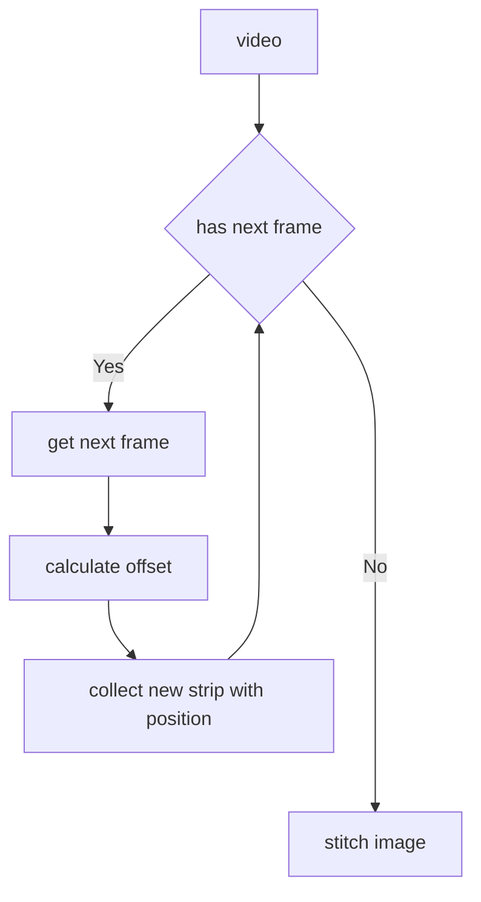

# Variable Strip Photography Workflow

```mermaid

flowchart TD
	
	V[video] --> QNF{has next frame}
	QNF -- Yes --> F[get next frame]
	F --> M[calculate offset]
	M --> C[collect new strip with position]
	C --> QNF
	QNF -- No -----> SI[stitch image]

```